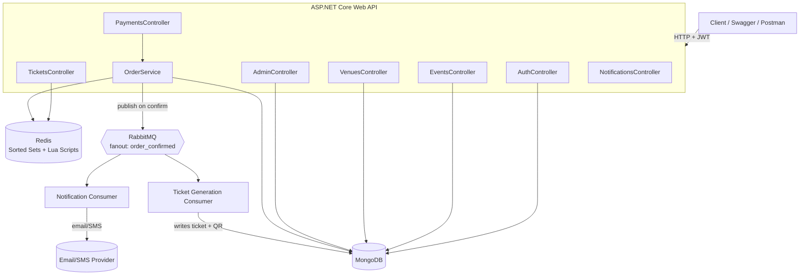
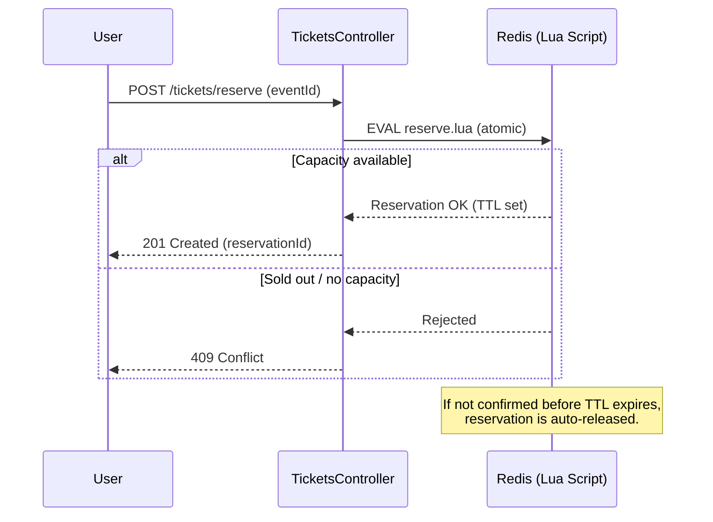
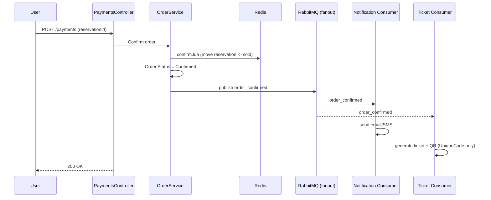
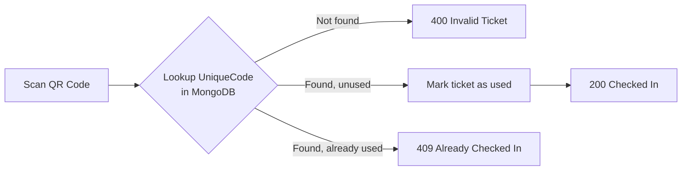

# Event & Ticket Management Platform

A backend platform for managing events, ticket reservations, payments, and check-in — built with **ASP.NET Core Web API**, **MongoDB**, **Redis**, and **RabbitMQ**.

This is the first implementation of the project (a second version in Python/FastAPI is planned later). The .NET stack was chosen first for faster iteration on the MongoDB/Redis/RabbitMQ-heavy parts.

---

## Table of Contents

- [Overview](#overview)
- [Tech Stack](#tech-stack)
- [Architecture](#architecture)
- [Core Flows](#core-flows)
  - [Ticket Reservation (Redis)](#ticket-reservation-redis)
  - [Order Confirmation & Notifications (RabbitMQ)](#order-confirmation--notifications-rabbitmq)
  - [Check-in Flow](#check-in-flow)
- [Authentication](#authentication)
- [Controllers](#controllers)
- [Key Design Decisions](#key-design-decisions)
- [Getting Started](#getting-started)

---

## Overview

The platform allows:
- Admins to create **Events**, **Venues**, and **Event Categories**
- Users to **register/login**, browse events, and **reserve tickets**
- A **Redis-based reservation system** to atomically manage limited ticket inventory and prevent overselling
- **Payment** processing that confirms an order (1:1 with a single payment)
- **RabbitMQ**-driven, asynchronous **notifications** (email/SMS) and **ticket generation** (QR code) once an order is confirmed
- A **check-in endpoint** that validates a ticket's QR code at the event entrance

An `Event` is intentionally simple — no sub-schedule, sessions, or speakers. It represents a single event at a single venue.

---

## Tech Stack

| Layer | Technology |
|---|---|
| API | ASP.NET Core Web API (C#) |
| Database | MongoDB |
| Caching / Reservation locking | Redis (Sorted Sets + Lua scripts) |
| Messaging | RabbitMQ (fanout exchange) |
| Auth | JWT (simple, no OAuth2) |
| Password hashing | BCrypt.Net-Next |

---

## Architecture



---

## Core Flows

### Ticket Reservation (Redis)

Ticket inventory is tracked in Redis rather than hitting MongoDB directly, so that concurrent reservation attempts are handled atomically without race conditions.

- **Sorted Set** holds active reservations per event, scored by expiry time
- A **sold counter** tracks confirmed tickets against total capacity
- **Lua scripts** perform `reserve`, `confirm`, and `release` as single atomic operations on Redis, so two users can never reserve the same last ticket



### Order Confirmation & Notifications (RabbitMQ)

Once a reservation is paid for, the Order is confirmed and an `order_confirmed` event is published to a **fanout exchange**, which broadcasts to two independent queues — decoupling notification delivery and ticket generation from the request/response cycle.



### Check-in Flow

The ticket's QR code encodes only a `UniqueCode` — no personal or event details — which is looked up server-side at scan time.



---

## Authentication

- **Simple JWT auth** (no OAuth2), chosen to keep focus on the MongoDB/Redis/RabbitMQ learning goals
- Passwords hashed with **BCrypt**
- On login/register, a signed JWT is issued containing the user's `id`, `email`, `name`, and `role` claims
- Protected endpoints use `[Authorize]`; role-restricted endpoints (e.g. Admin-only) use `[Authorize(Roles = "Admin")]`
- Controllers read the authenticated user's id from the token claims (`User.FindFirst(...)`) rather than trusting a client-supplied `userId` in the request body
- **Rate limiting** applied to auth endpoints (IP-based fixed window) to mitigate brute-force login attempts

---

## Controllers

| Controller | Responsibility | Access |
|---|---|---|
| `AuthController` | Register / Login | Public |
| `UsersController` | User profile management | Authenticated |
| `EventsController` | Event CRUD | Read: Public · Write: Admin |
| `VenuesController` | Venue CRUD | Read: Public · Write: Admin |
| `EventCategoriesController` | Category CRUD | Read: Public · Write: Admin |
| `TicketsController` | Reservation, ticket retrieval, check-in | Authenticated |
| `PaymentsController` | Confirm payment for a reservation | Authenticated |
| `NotificationsController` | Notification-related endpoints | Authenticated / internal |
| `AdminController` | Admin dashboard / stats | Admin only |

Only `OrderService` exists as a separate service layer; other controllers talk to MongoDB collections directly (no repository layer).

---

## Key Design Decisions

- **Redis + Lua for reservations** — avoids overselling under concurrent requests without needing distributed locks or database transactions
- **RabbitMQ fanout exchange** — decouples "an order was confirmed" from "what happens next" (notifications, ticket generation can scale/fail independently)
- **QR encodes only a UniqueCode** — keeps tickets lightweight and avoids exposing personal data in a scannable code
- **No Speaker/Session model** — Events are intentionally single, flat entities; no internal sub-schedule
- **1:1 Payment–Order relationship** — one payment per order, keeping the payment model simple
- **JWT over OAuth2** — reduces complexity for a learning-focused project where the goal is understanding auth mechanics, not integrating a third-party identity provider

---

## Getting Started

```bash
# Restore dependencies
dotnet restore

# Configure appsettings.json / user secrets:
# - MongoDB connection string
# - Redis connection string
# - RabbitMQ connection string
# - JWT settings (SecretKey, Issuer, Audience, ExpiryMinutes)

# Run the API
dotnet run
```
