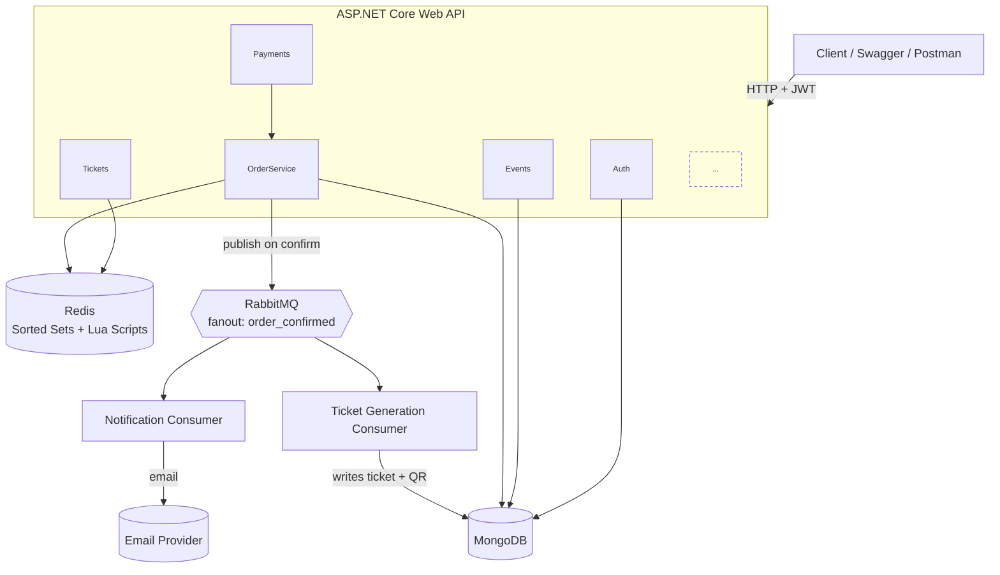
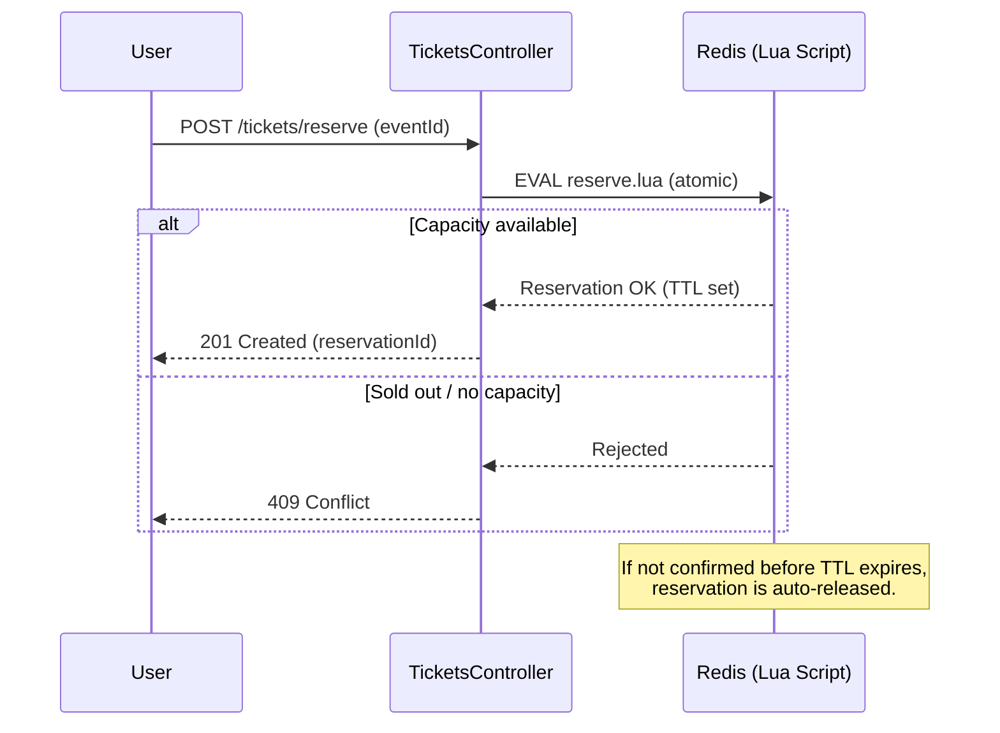
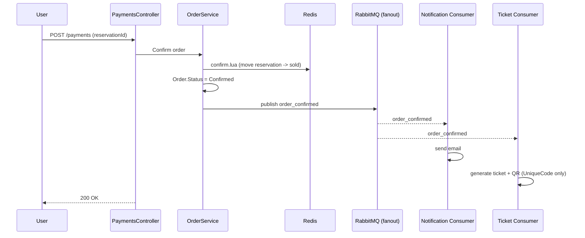
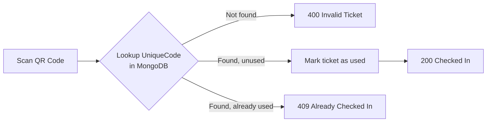

# Event & Ticket Management Platform

A backend platform for managing events, ticket reservations, payments, and check-in — built with **ASP.NET Core Web API**, **MongoDB**, **Redis**, and **RabbitMQ**.

---

## Table of Contents

- [Overview](#overview)
- [Tech Stack](#tech-stack)
- [Architecture](#architecture)
- [Core Flows](#core-flows)
  - [Ticket Reservation (Redis)](#ticket-reservation-redis)
  - [Order Confirmation & Notifications (RabbitMQ)](#order-confirmation--notifications-rabbitmq)
  - [Check-in Flow](#check-in-flow)
- [Authentication](#authentication)
- [Controllers](#controllers)
- [Key Design Decisions](#key-design-decisions)
- [Running with Docker](#running-with-docker)
  - [Services & Default Credentials](#services--default-credentials)
  - [Personalizing the Configuration](#personalizing-the-configuration)
  - [Step-by-Step: Running the Project](#step-by-step-running-the-project)
- [Getting Started (without Docker)](#getting-started-without-docker)

---

## Overview

The platform allows:
- Admins to create **Events**, **Venues**, and **Event Categories**
- Users to **register/login**, browse events, and **reserve tickets**
- A **Redis-based reservation system** to atomically manage limited ticket inventory and prevent overselling
- **Payment** processing that confirms an order (1:1 with a single payment)
- **RabbitMQ**-driven, asynchronous **notifications** (email) and **ticket generation** (QR code) once an order is confirmed
- A **check-in endpoint** that validates a ticket's QR code at the event entrance

---

## Tech Stack

| Layer | Technology |
|---|---|
| API | ASP.NET Core Web API (C#) |
| Database | MongoDB |
| Caching / Reservation locking | Redis (Sorted Sets + Lua scripts) |
| Messaging | RabbitMQ (fanout exchange) |
| Auth | JWT |
| Password hashing | BCrypt.Net-Next |

---

## Architecture



---

## Core Flows

### Ticket Reservation (Redis)

Ticket inventory is tracked in Redis rather than hitting MongoDB directly, so that concurrent reservation attempts are handled atomically without race conditions.

- **Sorted Set** holds active reservations per event, scored by expiry time
- A **sold counter** tracks confirmed tickets against total capacity
- **Lua scripts** perform `reserve`, `confirm`, and `release` as single atomic operations on Redis, so two users can never reserve the same last ticket



### Order Confirmation & Notifications (RabbitMQ)

Once a reservation is paid for, the Order is confirmed and an `order_confirmed` event is published to a **fanout exchange**, which broadcasts to two independent queues — decoupling notification delivery and ticket generation from the request/response cycle.



### Check-in Flow

The ticket's QR code encodes only a `UniqueCode` — no personal or event details — which is looked up server-side at scan time.



---

## Authentication

- **Simple JWT auth** (no OAuth2), chosen to keep focus on the MongoDB/Redis/RabbitMQ learning goals
- Passwords hashed with **BCrypt**
- On login/register, a signed JWT is issued containing the user's `id`, `email`, `name`, and `role` claims
- Protected endpoints use `[Authorize]`; role-restricted endpoints (e.g. Admin-only) use `[Authorize(Roles = "Admin")]`
- Controllers read the authenticated user's id from the token claims (`User.FindFirst(...)`) rather than trusting a client-supplied `userId` in the request body
- **Rate limiting** applied to auth endpoints (IP-based fixed window) to mitigate brute-force login attempts

---

## Controllers

| Controller | Responsibility | Access |
|---|---|---|
| `AuthController` | Register / Login | Public |
| `UsersController` | User profile management | Authenticated |
| `EventsController` | Event CRUD | Read: Public · Write: Admin |
| `VenuesController` | Venue CRUD | Read: Public · Write: Admin |
| `EventCategoriesController` | Category CRUD | Read: Public · Write: Admin |
| `TicketsController` | Reservation, ticket retrieval, check-in | Authenticated |
| `PaymentsController` | Confirm payment for a reservation | Authenticated |
| `NotificationsController` | Notification-related endpoints | Authenticated / internal |

Only `OrderService` exists as a separate service layer; other controllers talk to MongoDB collections directly (no repository layer).

---

## Key Design Decisions

- **Redis + Lua for reservations** — avoids overselling under concurrent requests without needing distributed locks or database transactions
- **RabbitMQ fanout exchange** — decouples "an order was confirmed" from "what happens next" (notifications, ticket generation can scale/fail independently)
- **QR encodes only a UniqueCode** — keeps tickets lightweight and avoids exposing personal data in a scannable code
- **1:1 Payment–Order relationship** — one payment per order, keeping the payment model simple
- **JWT over OAuth2** — reduces complexity for a learning-focused project where the goal is understanding auth mechanics, not integrating a third-party identity provider

---

## Running with Docker

The project ships with a `Dockerfile` (next to `Program.cs`, inside the `EventTicketManagement` project folder) and a `docker-compose.yml` at the repository root. Compose spins up the API together with MongoDB, Redis, and RabbitMQ, all pre-wired to talk to each other — no local installs needed.

```
/ (repo root)
  /EventTicketManagement
    EventTicketManagement.csproj
    Program.cs
    Dockerfile
  docker-compose.yml
```

```yaml
services:
  api:
    build:
      context: .
      dockerfile: EventTicketManagement/Dockerfile
    ports:
      - "8080:8080"
    environment:
      - ASPNETCORE_ENVIRONMENT=Development
      - ASPNETCORE_URLS=http://+:8080
      - MongoSettings__ConnectionString=mongodb://mongo:27017
      - MongoSettings__DatabaseName=EventTicketManagement
      - Redis__ConnectionString=redis:6379
      - RabbitMQ__Host=rabbitmq
      - RabbitMQ__Username=guest
      - RabbitMQ__Password=guest
      - JwtSettings__SecretKey=CHANGE_THIS_TO_A_REAL_SECRET_KEY_32CHARS
      - JwtSettings__Issuer=EventTicketPlatform
      - JwtSettings__Audience=EventTicketPlatformUsers
      - JwtSettings__ExpiryMinutes=60
    depends_on:
      - mongo
      - redis
      - rabbitmq

  mongo:
    image: mongo:7
    ports:
      - "27017:27017"
    volumes:
      - mongo_data:/data/db

  redis:
    image: redis:7
    ports:
      - "6379:6379"
    volumes:
      - redis_data:/data

  rabbitmq:
    image: rabbitmq:3-management
    ports:
      - "5672:5672"    # AMQP (used by the API to publish/consume)
      - "15672:15672"  # Web management dashboard
    volumes:
      - rabbitmq_data:/var/lib/rabbitmq

volumes:
  mongo_data:
  redis_data:
  rabbitmq_data:
```

### Services & Default Credentials

Everything below reflects the **default `docker-compose.yml` values**, meant for local development only.

| Service | Container hostname | Host port(s) | Username | Password | Notes |
|---|---|---|---|---|---|
| API | `api` | `8080` | — | — | `http://localhost:8080` |
| MongoDB | `mongo` | `27017` | *(none by default)* | *(none by default)* | No auth enabled by default; database name: `EventTicketManagement` |
| Redis | `redis` | `6379` | *(none)* | *(none)* | No auth enabled by default |
| RabbitMQ (AMQP) | `rabbitmq` | `5672` | `guest` | `guest` | Used internally by the API to publish/consume events |
| RabbitMQ (dashboard) | `rabbitmq` | `15672` | `guest` | `guest` | Open `http://localhost:15672` in a browser to inspect queues/exchanges |

> ⚠️ `guest`/`guest` and no-auth databases are fine for local development, but **must be changed before any real deployment** — see below.

### Personalizing the Configuration

All the values a user might want to change live in the `environment:` block of the `api` service in `docker-compose.yml`. Nothing needs to be edited inside the C# code or `appsettings.json` — Docker environment variables override them automatically.

**To change the JWT secret:**
```yaml
- JwtSettings__SecretKey=your-own-secret-key-at-least-32-characters-long
```

**To change the MongoDB database name:**
```yaml
- MongoSettings__DatabaseName=YourDatabaseName
```

**To add authentication to MongoDB/Redis/RabbitMQ** (recommended before deploying anywhere public):
```yaml
rabbitmq:
  environment:
    - RABBITMQ_DEFAULT_USER=your_username
    - RABBITMQ_DEFAULT_PASS=your_strong_password
```
and correspondingly update the `api` service:
```yaml
- RabbitMQ__Username=your_username
- RabbitMQ__Password=your_strong_password
```

**To change exposed ports** (e.g. if `8080` is already used on your machine), edit the left side of the `ports` mapping (`host:container`):
```yaml
ports:
  - "9000:8080"   # now reachable at localhost:9000
```

> Note the double-underscore (`__`) syntax, e.g. `MongoSettings__ConnectionString` — this is how ASP.NET Core maps a flat environment variable to a nested key (`MongoSettings:ConnectionString`) in `appsettings.json`.

### Step-by-Step: Running the Project

1. **Install Docker** — [Docker Desktop](https://www.docker.com/products/docker-desktop/) (Windows/Mac) or Docker Engine + Compose plugin (Linux).

2. **Clone the repository**
   ```bash
   git clone <repo-url>
   cd <repo-folder>
   ```

3. **(Optional) Personalize credentials** — open `docker-compose.yml` and update the values described above (JWT secret, RabbitMQ credentials, ports) if you don't want the defaults.

4. **Build and start everything**
   ```bash
   docker compose up --build
   ```
   This builds the API image and starts the API, MongoDB, Redis, and RabbitMQ containers together, in the correct startup order.

5. **Wait for startup** — the first run downloads the MongoDB/Redis/RabbitMQ images and builds the API, so it can take a minute or two. Subsequent runs are much faster thanks to Docker layer caching.

6. **Verify it's running:**
   - API: `http://localhost:8080/swagger` (Swagger UI)
   - RabbitMQ dashboard: `http://localhost:15672` (login `guest` / `guest`, or your custom credentials)

7. **Try it out** — register a user, log in, copy the returned JWT, click **Authorize** in Swagger, paste the token, and start calling protected endpoints.

8. **Stop everything**
   ```bash
   docker compose down
   ```
   Add `-v` (`docker compose down -v`) if you also want to wipe the MongoDB/Redis/RabbitMQ data volumes and start fresh next time.

---

## Getting Started (without Docker)

```bash
# Restore dependencies
dotnet restore

# Configure appsettings.json / user secrets:
# - MongoDB connection string
# - Redis connection string
# - RabbitMQ connection string
# - JWT settings (SecretKey, Issuer, Audience, ExpiryMinutes)

# Run the API
dotnet run```
